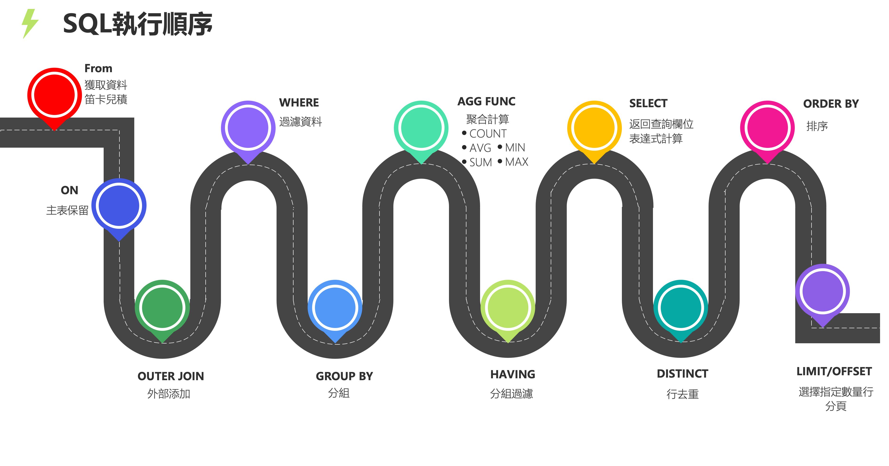
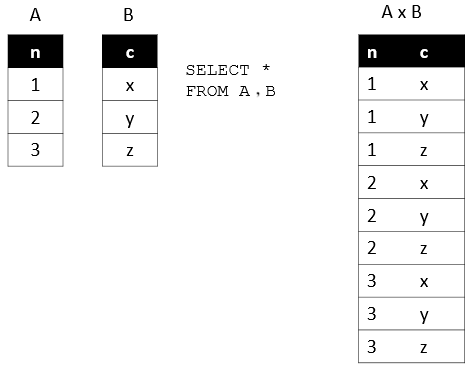

# Query的書寫順序與執行順序
## 書寫順序
SELECT子句是必須的，其他子句如WHERE子句、GROUP BY子句等是可選的。
在查詢語句中，子句的順序是固定的，必須嚴格按照以下的順序書寫。
```sql
SELECT DISTINCT <Select_list>
FROM <left_table> <join_type>JOIN<right_table>
ON<join_condition>
WHERE<where_condition>
GROUP BY<group_by_list>
WITH {CUBE|ROLLUP}
HAVING<having_condtion>
ORDER BY<order_by_list>
LIMIT<limit_number>
```
## 執行順序
  
所有的查詢語句都是從FROM開始執行，在執行過程中，每個步驟都會生成一個虛擬表，這個虛擬表將作為下一個執行步驟的輸入，最後一個步驟產生的虛擬表即為輸出結果。
```sql
(9) SELECT 
(10) DISTINCT <column>,
(6) AGG_FUNC <column> or <expression>, ...
(1) FROM <left_table> 
    (3) <join_type>JOIN<right_table>
    (2) ON<join_condition>
(4) WHERE <where_condition>
(5) GROUP BY <group_by_list>
(7) WITH {CUBE|ROLLUP}
(8) HAVING <having_condtion>
(11) ORDER BY <order_by_list>
(12) LIMIT <limit_number>;
```

接下來，我們會詳細地介紹每個步驟的具體執行過程
### 1. FROM 獲取資料
FROM子句會對子句中的前兩個表執行笛卡兒積(Cross Join)，生成虛擬表 `VT1`。
  
FROM子句執行順序為從後往前，從右到左。FROM子句中最末尾的表(基礎表 driving table)將被最優先處理，當FROM子句中包含多個表的情況下，我們需要選擇數據最少的表作為基礎表。

### 2. ON 篩選器
對虛擬表`VT1`應用 ON 篩選器， ON 子句中的邏輯表達式將應用到虛擬表`VT1`中各個行，篩選出滿足 ON 子句邏輯表達式的行，生成虛擬表`VT2`。

### 3. OUTER JOIN 添加外部行
如果指定了 OUTER JOIN ，則在虛擬表`VT2`的基礎上添加保留表中未匹配 ON 子句邏輯表達式的數據，非保留表中的數據被賦予 NULL 值，最後生成虛擬表`VT3`。  
保留表如下：
- LEFT OUTER JOIN 將左表作為保留表
- RIGHT OUTER JOIN 將右表作為保留表
- FULL OUTER JOIN 將左右表都作為保留表

如果FROM子句包含兩個以上的表，則對上一個JOIN生成的虛擬表和下一個表重覆執行步驟1-3，直到處理完所有的表為止。

### 4. WHERE 篩選器
對虛擬表`VT3`應用WHERE子句的邏輯表達式，留下滿足指定條件的數據 並生成虛擬表`VT4`
- 由於數據還沒有分組，因此不能在WHERE子句中使用聚合函數。
- 同時，由於還沒有進行SELECT，因為也不允許使用 SELECT子句中的別名Alias

> 如果我們有一個條件需要去篩選，應該在 ON 篩選器還是用 WHERE 篩選器去指定呢？
> ON 和 WHERE 最大區別在於，如果在 ON 應該邏輯表達式進行篩選，那麼在第三步OUTER JOIN中還可以把不滿足條件的行添加回來，而WHERE移除的行是不可挽回的。
> 
### 5. GROUP BY 分組
按 GROUP BY 子句中的 列 Column/ 列表 將虛擬表`VT4`中的行分組，生成虛擬表`VT5`。如果使用了 GROUP BY 子句，那麼後面的所有步驟都只能得到虛擬表`VT5`的列或者是聚合函數(COUNT、SUM、AVG等)，原因是最後的結果每一組數據集中在一行裡。

> 注意： 由於 MYSQL 對查詢做了加強，所以在 GROUP BY 及之後的語句中允許使用 SELECT 子句定義的 AS 別名字段，這在其他資料庫是不被允許的。
### 6. AGG_FUNCTION 聚合函數
使用SQL Aggregate 聚合函數的前提是有對數據使用GROUP BY進行分組，聚合函數會從每一組數據裡返回一個單一的計算結果。常用的聚合函數包含以下幾種：  
- AVG: 返回平均值
- COUNT: 返回行數
- FIRST: 返回第一個記錄的值
- LAST: 返回最後一個記錄的值
- MAX: 返回最大值
- MIN： 返回最小值
- SUM: 返回總和
### 7. WITH 應用 ROLLUP 或 CUBE
對虛擬表`VT5`應用 ROLLUP 或 CUBE ，生成虛擬表`VT6`。 CUBE 和 ROLLUP 區別如下：  
- CUBE 生成的結果數據集顯示了所選列中值的所有組合的聚合。
- ROLLUP 生成的結果數據集顯示了所選列中值的某一層次結構的聚合。
### 8. HAVING 篩選器
對虛擬表`VT6`應用HAVING篩選器，根據祭定的條件對數據 進行篩選，並把滿足的數據捶入虛擬表`VT7`。  
HAVING子句在SQL中的作用和WHERE子句的作用是相同的，但是HAVING子句是過濾GROUP BY的分組結果，而WHERE子句無法和聚合函數一起使用。
### 9. SELECT 選出指定列
將虛擬表`VT7`中的數據只保留SELECT子句中指定的列，並對字段進行處理，計算表達式，產生虛擬表`VT8`。
### 10. DISTINCT 去重
將重覆的行從虛擬表`VT8`中移除，產生虛擬表`VT9`。 假如已經應用了 GROUP BY 那麼 DISTINCT 是多餘的，因為分組的時候是將列中唯一的值分成一組，同時只為每一組返回一行記錄，此時每行記錄都是不相同的。
### 11. ORDER BY 排序
將虛擬表`VT9`中的行按 ORDER BY 子句中的 列/列表排序，生成游標`VC10`，此時返回的游標，而不是虛擬表。 SQL是基於集合的，集合不會預先對行進行排序，它只是成只的邏 輯集合，成員的順序是無關緊要的。對表進行排序的查詢可以返回一個對象，這個對象包含特定的物理順序的邏輯組織，這個對象就叫游標。正因為返回值是游標而不是虛擬表，因此 ORDER BY 子句不能使用表達式。ORDER 子句的執行順序為從左到右排序，此操作非常消耗資源。
### 12. LIMIT/OFFSET 返回指定行
從`VC10`的開始處選擇指定行或指定數量，生成虛擬表`VT11`。

以上為「查詢過程」每個步驟的詳細解說，當步驟執行完畢且沒有後續步驟時，會立即返回該步驟所生成的虛擬表給使用者。
